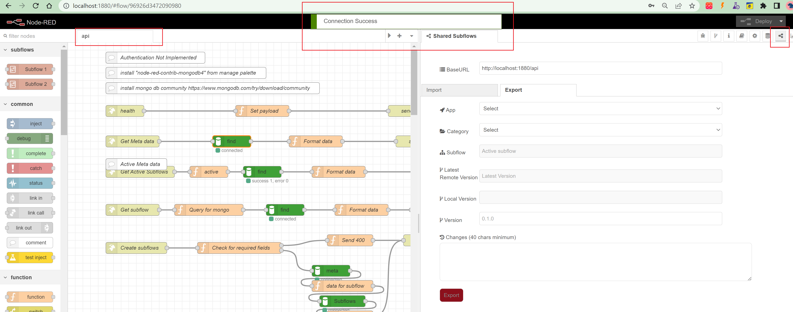

# topological-nodered-shared-subflows
Node Red nodes for Shared subflows with multiple users.
> This would only work with subflows.

Before you install this package, do the following steps for better understanding about how the shared subflows works.
* Install mongodb community https://www.mongodb.com/try/download/community.
* Install `node-red-contrib-mongodb4` nodes using manage palette to connect to mongo db.

## How it works?
* Install this package from Manage palette.
* Import `topological-nodered-shared-subflows-api` example for the supporting API Code.

Now we can see a side tab in node-red and set the BaseURL to `http://localhost:1880/api`. A successful connection message will be displayed if everything is working together as shown below.

We tried to add validations from the UI to avoid data related errors.

One of our intention while designing was to keep the UI and API as separate entities so that people will have the flexibility to do store the subflows in different ways. Right now we used mongo as our data stroe, but we can use files or some other data source based on API.

We included the swagger contract `swagger.yaml` as part of this project, which can be found in `.node-red/node_modules/topological-nodered-shared-subflows` folder. Go to https://editor.swagger.io/ to open the swagger file to display expected contract while designing your api.